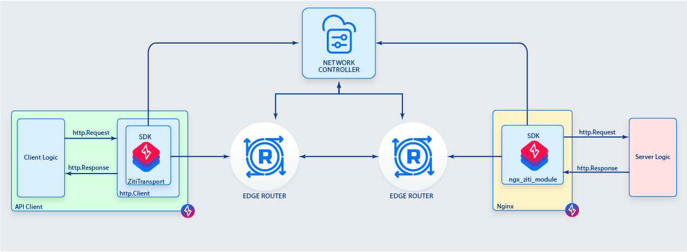
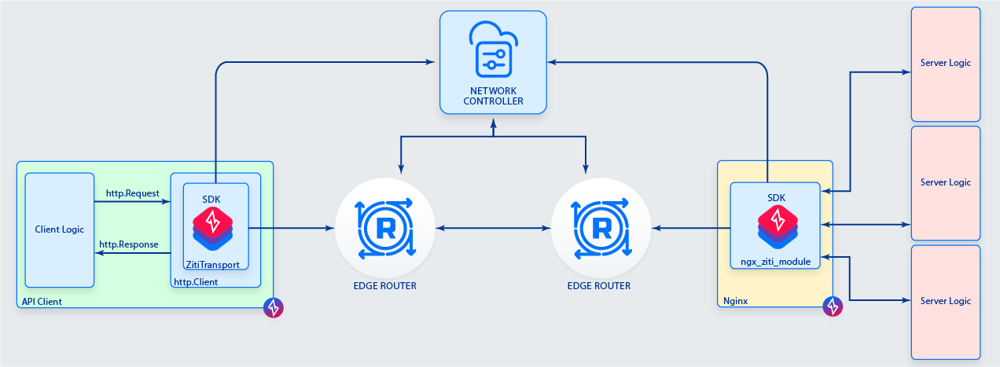

# ngx_ziti_module

This is an NGINX module that enables NGINX to `bind` OpenZiti services and then forward incoming 
connections to upstream addresses. To compile this module and to run it, Nginx must be compiled 
with the `--with-threads` option. This is not available on Windows. You can verify if `nginx` 
was compiled with `--with-threads` via `nginx -V`.




# Building

This module can be built in two fashions, it can be built via `nginx`'s built-in configuration
scripts or via CMake. The CMake build uses nginx's configuration scripts under the hood and 
allows for better integration with modern IDE's like Clion.


## Build Via Nginx

```shell
sudo apt install libuv1-dev

wget 'http://nginx.org/download/nginx-1.23.2.tar.gz'
tar -xzvf nginx-1.23.2.tar.gz

# See https://github.com/openziti/ziti-sdk-c/releases for other platforms
wget 'https://github.com/openziti/ziti-sdk-c/releases/download/0.30.8/ziti-sdk-0.30.8-Linux-x86_64.zip'
unzip ziti-sdk-0.30.8-Linux-x86_64.zip -d ziti-sdk-0.30.8-Linux-x86_64 

wget "https://github.com/openziti/uv-mbed/archive/refs/tags/v0.14.11.tar.gz"
mv v0.14.11.tar.gz uv_mbed-0.14.11.tar.gz
tar -xzvf uv_mbed-0.14.11.tar.gz

cd nginx-1.23.2/

# Here we assume you would install you nginx under: /opt/nginx
cd nginx-1.23.2/
./configure        \
    --prefix="/opt/nginx"     \
    --add-module="../" \
    --with-threads     \
    --with-compat      \
    --with-ld-opt=../ziti-sdk-0.30.8-Linux-x86_64/lib/libziti.so \
    --with-cc-opt="-I ../include -I ../uv-mbed-0.14.11/include"
make
make install
```

## Build using CMake

```shell
mkdir cmake-build
cd cmake-build
cmake ../
make
```

This build will produce an `nginx` binary in `cmake-build-debug/_deps/nginx/src/nginx` and can be executed with 
following arguments to run/debug this module: `nginx -c configs/nginx.conf -e logs/err.log -p ./`.

# Using

After building and installing the `ngx_ziti_module.so` the following configuration block
can be used to configure `nginx`:

```
load_module ngx_ziti_module.so;

error_log /dev/stderr debug;
error_log logs/error.log debug;

thread_pool ngx_ziti_tp threads=32 max_queue=65536;

events {
    worker_connections  1024;
}

ziti identity1 {
    identity_file /path/to/ziti/identity1.json;

    bind http-service {
        upstream localhost:7070;
    }
}

ziti identity2 {
    identity_file /path/to/ziti/identity2.json;

    bind http-service {
        upstream api.example.com:443;
    }
}
```

## `ziti` blocks

Multiple `ziti` blocks can be added to the root of your nginx configuration. Each block represents
a single OpenZiti identity. Directly after the `ziti` statement a name can be given. This name is for
organizational and logging purposes only.

### `identity_file`

Each `ziti` block must have exactly one `identity_file`. Different `ziti` blocks may use the same
identity if desired. The value provided should be a path to an OpenZiti identity file that is
stored in `json` format.

### `bind` blocks

Within each `ziti` block, multiple `bind` blocks are allowed. The value directly after the `bind`
statement is the name of the OpenZiti service that the identity should attempt to bind. One must
ensure that the identity of the containing `ziti` block has access to "bind" (host) the service
via OpenZiti policies.

#### `upstream`

Each `bind` block may have at most one `upstream` value. This value must be a hostname and port
combination in the format of `host:port` to the target back end hosting service.